# Free — Diagrams

> Visual reference for the app's architecture, data flows, and state machines.

---

## 1. High-Level Architecture

```mermaid
flowchart TB
  subgraph UI["AppKit UI (108 files)"]
    Shell["Shell + Sidebar + Status Item"]
    Focus["Focus Section"]
    RulesUI["Allowed Websites"]
    SchedulesUI["Schedules"]
    PomodoroUI["Pomodoro"]
    CalendarUI["Calendar"]
    SettingsUI["Settings"]
  end

  subgraph State["State Core"]
    AppState["AppState\n(@Observable source of truth)"]
    ReadModel["Read Model\n(derived state)"]
    Facade["AppStateLogicFacade\n(dispatch router)"]
    Persist["PersistenceCoordinator\n(observation → UserDefaults)"]
    Bootstrap["BootstrapService\n(load on launch)"]
    Store["SettingsStore\n(UserDefaults)"]
  end

  subgraph Domain["Domain Coordinators + Services"]
    SessionC["Session Coordinator"]
    SchedC["Schedule Coordinator\n+ ScheduleCheck Coordinator"]
    FocusC["FocusFlow Coordinator\n(pomodoro + pause)"]
    RulesC["RuleSet Coordinator"]
    BlockingC["Blocking Coordinator"]
    ScheduleEngine["ScheduleEngine\n(stateless)"]
    PomodoroEngine["PomodoroEngine\n(stateless)"]
    PauseEngine["PauseEngine\n(stateless)"]
    RuleSetSvc["RuleSetService\n(resolve active rules)"]
    CalendarSvc["CalendarImport/SyncService"]
  end

  subgraph Enforcement["Blocking Enforcement (background thread)"]
    Monitor["BrowserMonitor\n(1.5s polling)"]
    Matcher["RuleMatcher\n(wildcards → Regex)"]
    Automator["DefaultBrowserAutomator\n(AppleScript + AX)"]
    LocalServer["LocalServer\nlocalhost:10000"]
  end

  subgraph OS["macOS / External"]
    Browsers["Browsers\n(Safari/Chrome/Arc/...)"]
    EventKit["EventKit\n(Calendar)"]
    AppleScript["AppleScript\nAutomation"]
    AX["Accessibility API\n(AXUIElement)"]
  end

  Shell --> AppState
  Focus --> AppState
  RulesUI --> AppState
  SchedulesUI --> AppState
  PomodoroUI --> AppState
  CalendarUI --> AppState
  SettingsUI --> AppState

  AppState --> ReadModel
  AppState --> Facade
  Facade --> SessionC
  Facade --> SchedC
  Facade --> FocusC
  Facade --> RulesC
  Facade --> BlockingC

  SchedC --> ScheduleEngine
  FocusC --> PomodoroEngine
  FocusC --> PauseEngine
  RulesC --> RuleSetSvc
  CalendarSvc --> EventKit
  AppState --> CalendarSvc

  Bootstrap --> Store
  Persist --> Store
  Store -->|load on launch| AppState
  AppState -->|"observed changes"| Persist

  AppState -->|"TrustedState snapshot\n(isBlocking + allowedRules)"| Monitor
  Monitor --> Matcher
  Monitor --> Automator
  Automator --> AppleScript
  Automator --> AX
  AppleScript --> Browsers
  AX --> Browsers
  Automator -->|"redirect to localhost:10000"| Browsers
  Browsers --> LocalServer
```

---

## 2. Blocking Loop Flowchart

The core enforcement loop runs every 1.5 seconds on a background thread.

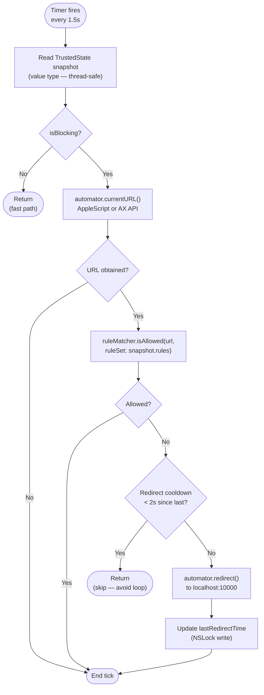

---

## 3. Session Start/Stop Flow

How a user action triggers blocking state across all layers.

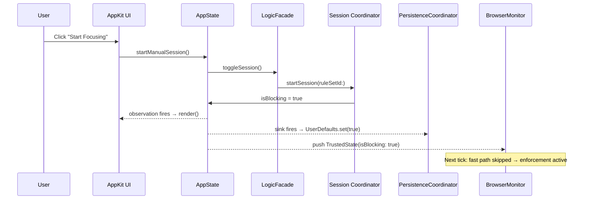

---

## 4. Pomodoro State Machine

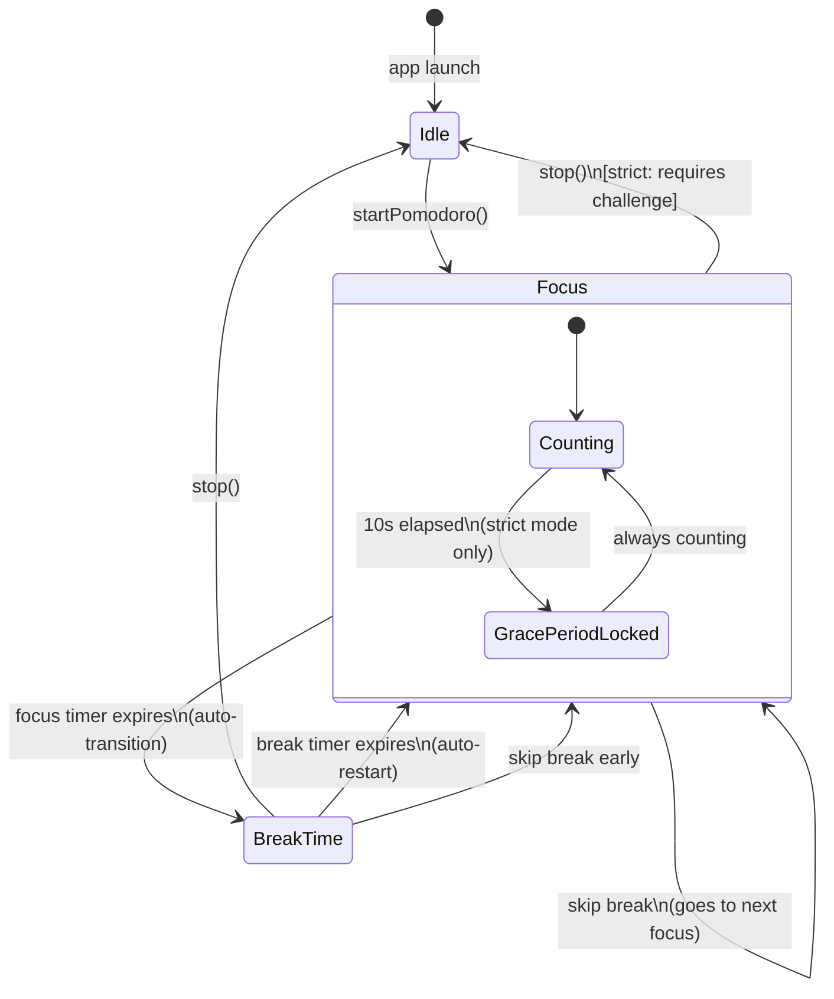

---

## 5. Schedule Evaluation Flow

How scheduled blocks activate and deactivate blocking automatically.

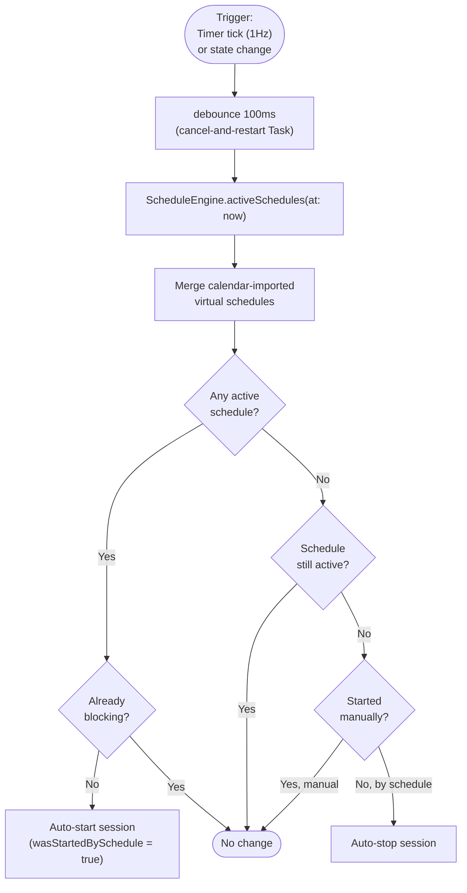

---

## 6. Calendar Integration Flow

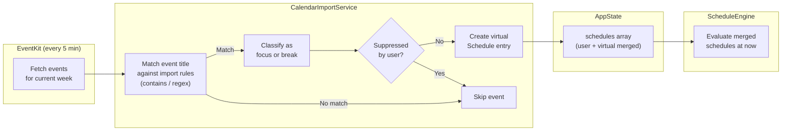

---

## 7. URL Matching Flow

How `RuleMatcher` decides if a URL is allowed.

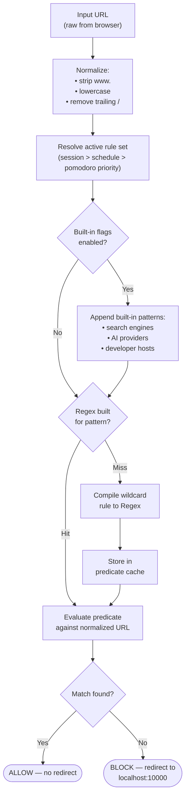

---

## 8. Threading Model

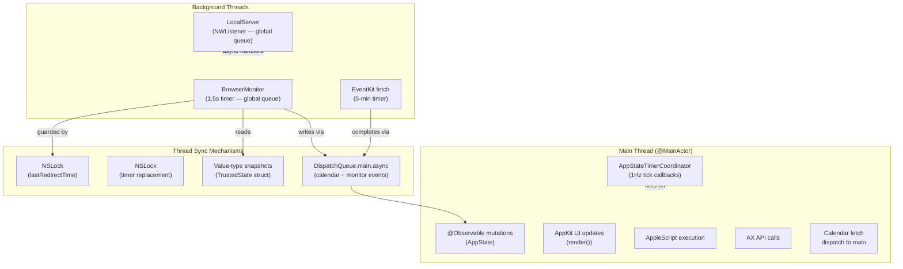

---

## 9. Strict Mode — Quit Protection Flow

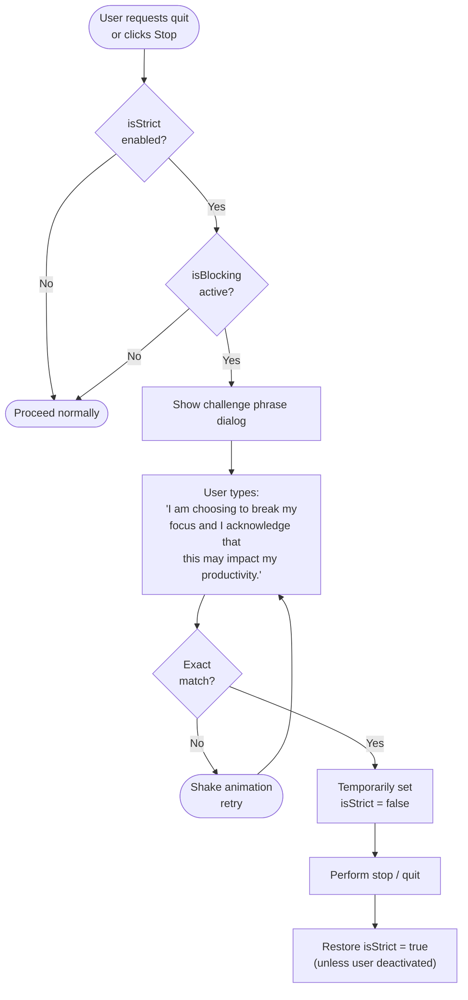

---

## 10. Data Persistence Flow

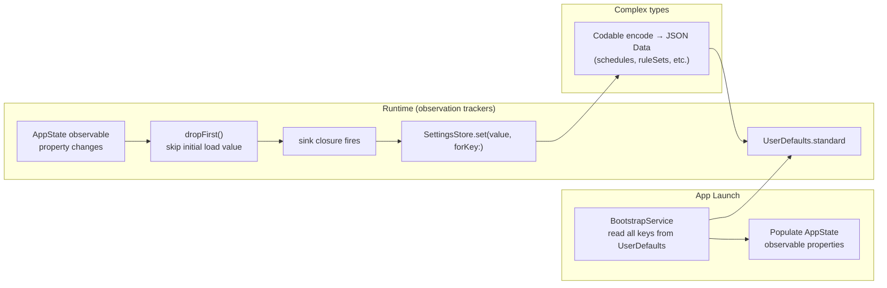

---

## 11. UI Observation Pattern

How AppKit view controllers stay in sync with `AppState`.

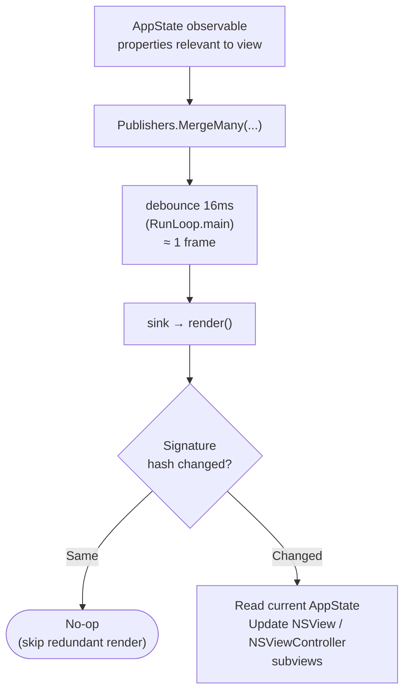

---

## 12. App Initialisation Sequence

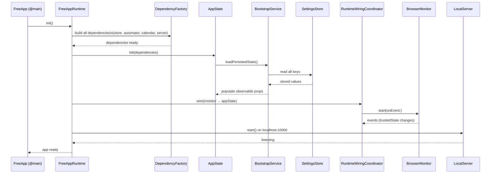

---

* Free macOS App*
