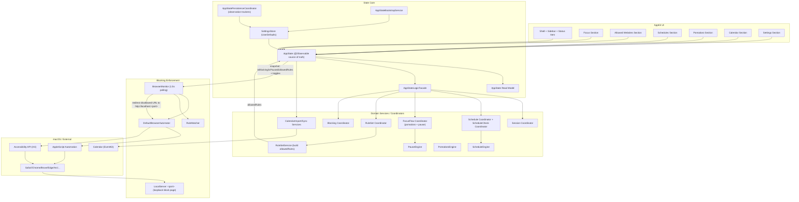

# Free: macOS App Deep Dive

> Reference document for the YouTube video. Covers architecture, logic, threading, features, testing, and design decisions.

---

## Table of Contents

- [Free: macOS App Deep Dive](#free-macos-app-deep-dive)
  - [Table of Contents](#table-of-contents)
  - [1. What is Free?](#1-what-is-free)
  - [2. High-Level Architecture](#2-high-level-architecture)
    - [2-1 Full Architecture Flowchart](#2-1-full-architecture-flowchart)
    - [2-2 Simplified Architecture Flowchart](#2-2-simplified-architecture-flowchart)
  - [3. Module Breakdown](#3-module-breakdown)
    - [3-1 App Entry and Runtime](#3-1-app-entry-and-runtime)
    - [3-2 AppState: The Central Hub](#3-2-appstate-the-central-hub)
    - [3-3 Services Layer](#3-3-services-layer)
    - [3-4 Coordinators Layer](#3-4-coordinators-layer)
    - [3-5 Browser Monitor](#3-5-browser-monitor)
    - [3-6 Browser Automator](#3-6-browser-automator)
    - [3-7 Rule Matcher](#3-7-rule-matcher)
    - [3-8 Local Server](#3-8-local-server)
    - [3-9 Calendar Manager](#3-9-calendar-manager)
    - [3-10 UI Architecture](#3-10-ui-architecture)
  - [4. Threading Model](#4-threading-model)
  - [5. The Blocking Loop (Core Logic)](#5-the-blocking-loop-core-logic)
  - [6. Feature Walkthrough](#6-feature-walkthrough)
    - [6-1 Manual Focus Session](#6-1-manual-focus-session)
    - [6-2 Scheduled Focus Blocks](#6-2-scheduled-focus-blocks)
    - [6-3 Pomodoro Timer](#6-3-pomodoro-timer)
    - [6-4 Quick Breaks](#6-4-quick-breaks)
    - [6-5 Strict and Strict Mode](#6-5-strict-and-strict-mode)
    - [6-6 Allowed Websites and Rule Sets](#6-6-allowed-websites-and-rule-sets)
    - [6-7 Calendar Integration](#6-7-calendar-integration)
    - [6-8 Status Menu](#6-8-status-menu)
  - [7. State Management Deep Dive](#7-state-management-deep-dive)
  - [8. Persistence](#8-persistence)
  - [9. Testing Strategy](#9-testing-strategy)
  - [10. Design Patterns Reference](#10-design-patterns-reference)
    - [Event-Driven Trusted State (BrowserMonitor)](#event-driven-trusted-state-browsermonitor)
    - [Debounced Schedule Checking](#debounced-schedule-checking)
    - [Coordinator Pattern (not Apple's)](#coordinator-pattern-not-apples)
    - [Signature-Based Deduplication (UI Observation)](#signature-based-deduplication-ui-observation)
    - [Challenge-Based Unblock](#challenge-based-unblock)
    - [Grace Period Lock](#grace-period-lock)
  - [11. Notable Tradeoffs and Decisions](#11-notable-tradeoffs-and-decisions)

---

## 1. What is Free?

**Free** is a macOS focus app that blocks distracting websites in real time while you work. It intercepts the active browser tab, checks its URL against your allowed list, and redirects blocked pages to a local block page — all without a browser extension.

**Supported browsers:** Chrome, Safari, Firefox, Brave, Edge, Arc, Opera, Vivaldi.

**Core enforcement modes:**

| Mode | How it triggers |
|---|---|
| Manual | User toggles blocking on/off |
| Scheduled | Weekly calendar blocks (recurring or one-off) |
| Pomodoro | Automatic focus/break cycles |
| Calendar import | EventKit events matched by title rules |

All modes share the same underlying blocking engine — they only differ in *how* the session starts and stops.

---

## 2. High-Level Architecture

```
┌─────────────────────────────────────────────────────────────────┐
│                        AppKit UI (109 files)                    │
│  Shell / Sidebar / Sections / Floating editors / Status menu    │
└────────────────────────┬────────────────────────────────────────┘
                         │ observes (Observation)
┌────────────────────────▼────────────────────────────────────────┐
│                        AppState (@Observable)                 │
│  Central published state · Domain-split extensions              │
│                                                                  │
│  ┌──────────────┐  ┌──────────────┐  ┌──────────────────────┐  │
│  │ Coordinators │  │  Services    │  │ Persistence Trackers │  │
│  │ (stateful    │  │ (stateless   │  │ (UserDefaults via    │  │
│  │  orchestrate)│  │  business    │  │  Observation)        │  │
│  └──────┬───────┘  │  logic)      │  └──────────────────────┘  │
│         │          └──────────────┘                             │
└─────────┼───────────────────────────────────────────────────────┘
          │ reads state snapshot / sends actions
┌─────────▼───────────────────────────────────────────────────────┐
│                   BrowserMonitor (1.5 s timer)                  │
│   Reads browser URL → evaluates block → redirects to :<port>    │
│                                                                  │
│   DefaultBrowserAutomator          RuleMatcher                  │
│   (AppleScript + AX API)           (wildcards → Regex)           │
└─────────────────────────────────────────────────────────────────┘
          │
┌─────────▼───────────────────────────────────────────────────────┐
│           LocalServer (loopback, ephemeral port)                │
│              Serves block page HTML                             │
└─────────────────────────────────────────────────────────────────┘
```

### 2-1 Full Architecture Flowchart



### 2-2 Simplified Architecture Flowchart


**Key principles:**

- **AppKit-first** — full native macOS UI; no SwiftUI for the main app shell.
- **Protocol-decoupled I/O** — browser control, calendar, timers, and persistence are all behind protocols so they're swappable in tests.
- **Unidirectional data flow** — UI reads `AppState`, sends actions through coordinator methods; state flows back via Observation.
- **Swift 6** — strict concurrency, `@MainActor` annotations, `NSLock` where needed.

---

## 3. Module Breakdown

### 3-1 App Entry and Runtime

**Files:** `FreeApp.swift`, `FreeAppRuntime.swift`, `AppDelegate.swift`, `Sources/FreeApp/main.swift`

The app is pure AppKit (no SwiftUI). There are two build paths sharing one entry point:

- `FreeAppEntry.run()` (public, in `FreeLogic`) builds `AppState`, `AppDelegate`, and `FreeApp`, then runs `NSApplication`.
- The raw-`swiftc` bundle build (`build.sh`/`package.sh`) uses `@main enum FreeAppMain`, compiled only outside SwiftPM (`#if !SWIFT_PACKAGE`).
- The SwiftPM executable target (`swift run FreeApp`) is a two-line `main.swift` calling `FreeAppEntry.run()`.

`FreeApp` (a `@MainActor` class) wires the main window, status item, menu, and appearance, and binds shell state to `AppState` observation.

`AppState.init` builds the dependency graph via `AppStateDependencyFactory`, bootstraps persisted state via `AppStateBootstrapService`, binds persistence observers, and starts the runtime (browser monitor + calendar observation + schedule timer) via `AppStateLifecycleService`.

`AppDelegate` (`@MainActor`) handles system-level events: `applicationShouldTerminate` blocks quit during strict sessions (reading in-memory state via providers wired by `FreeApp`, not raw `UserDefaults`), and offers app-relocation to `/Applications` on first launch.

---

### 3-2 AppState: The Central Hub

**File:** `Sources/Free/Logic/State/AppState.swift` + 15+ extensions

`AppState` is a `@MainActor` `@Observable` class that owns all UI-facing state. It is the single source of truth. AppKit view controllers observe it through `withObservationTracking` helpers (see `AppKitAppStateObservation`), not Combine.

Domain-split via Swift extensions (one file per domain):

| Extension | Responsibility |
|---|---|
| `AppState+Actions` | Strict-mode challenges, launch-at-login, time formatting |
| `AppState+Pomodoro` | Pomodoro phase transitions and timer |
| `AppState+Schedules` | CRUD for schedule blocks |
| `AppState+Rules` | CRUD for rule sets / allowed websites |
| `AppState+Pause` | Quick-break state |
| `AppState+CalendarSync` | Rebuilding imported calendar schedules |
| `AppState+ReadModel` | Derived/computed state for UI |

Each extension calls `logicFacade` (a struct of pure functions) directly and applies the returned transition to state — there is deliberately no intermediate service layer between the extension and the facade.

**Why split into extensions?** `AppState` would be a 2000+ line god-object otherwise. Extensions let each feature domain own its slice while sharing the observable backing store.

---

### 3-3 Services Layer

Services are **stateless** — they receive state as input, return new state as output. Zero side effects.

| Service | What it does |
|---|---|
| `BlockingSessionService` | Computes next session state (blocking on/off transitions) |
| `ScheduleEngine` | Given a date/time, returns which schedules are currently active |
| `PomodoroEngine` | Pomodoro state machine: focus → break → focus |
| `PauseEngine` | Counts down break time, determines if still paused |
| `RuleSetService` | Resolves the active rule set for the current session |
| `CalendarImportService` | Maps EventKit events to focus/break schedule entries |
| `LaunchAtLoginService` | Registers/deregisters app with SMLoginItemSetEnabled |

**Architecture choice — stateless services:** Each service can be unit-tested with zero setup. Pass in state, assert on output. No mocking, no dependencies.

---

### 3-4 Coordinators Layer

Coordinators are **stateless namespaces of transition functions** — given current state, they return new state plus effect flags (run timer, stop timer, re-check schedules). `AppState` extensions reach them through `AppStateLogicFacade`, whose extension files map one facade method to one coordinator call.

The call chain is intentionally short: `AppState+X` extension → `logicFacade.x(...)` → coordinator → engine. (An earlier `*MutationService` layer of pure pass-through forwarders between the extensions and the facade was removed.)

Key coordinators:

**`AppStateSessionCoordinator`**
Session start/stop/check transitions. Checks strict-mode constraints, delegates to `BlockingSessionService`.

**`AppStateFocusFlowCoordinator`**
Pomodoro and pause transitions: start focus/break, stop-if-unlocked, ticks. Returns `PomodoroTransition`/`PauseTransition` values carrying timer-effect flags. Calls `PomodoroEngine`/`PauseEngine` directly.

Pomodoro phase computation and the 10-second grace-period lock in strict mode.

**`AppStateScheduleTickCoordinator`**
Computes the next wall-clock boundary (schedule start/end, calendar event edges) so the schedule timer wakes exactly when something changes instead of polling.

**`AppStateTimerCoordinator`**
Owns the live timers (schedule, pause, pomodoro). Replaces timers cleanly when settings change; `NSLock`-guarded swap-then-invalidate.

**`AppStatePersistenceCoordinator`**
One `@MainActor` tracker per persisted property: `withObservationTracking` re-arms itself and writes changed values to `SettingsStore`, deduplicated by `Equatable`.

**`AppStateRuntimeWiringCoordinator`**
Starts the runtime: observes `CalendarProvider.events` (re-arming observation tracker), arms the self-rescheduling schedule timer, and returns a cancellable for teardown.

---

### 3-5 Browser Monitor

**File:** `Sources/Free/Logic/BrowserMonitor.swift`

The beating heart of the app. Runs on a **1.5-second repeating timer**.

`BrowserMonitor` is an **actor with its own `DispatchSerialQueue` executor**, so the synchronous AppleScript round-trips it performs never occupy the shared cooperative thread pool. The tick timer is a `DispatchSourceTimer` delivered on the main queue (`DispatchRepeatingTimer`) — deliberately not `Timer.scheduledTimer`, which would install on an executor thread whose run loop never runs.

Each tick:

1. Re-check permissions on a slow cadence (every 30 s) and emit `.trustedStateChanged` only when the value changes — a revoked Accessibility/Automation grant surfaces in the UI instead of blocking failing silently.
2. Pull a **state snapshot** (`Sendable` struct) from `AppState` via an async MainActor provider. The provider also re-asserts the persisted strict/blocking flags against in-memory state (tamper repair).
3. Guard: not blocking, paused, or frontmost app not a supported browser → return.
4. Ask `BrowserAutomator` for the frontmost browser's current URL.
5. Special-case new-tab pages, developer/localhost hosts, and private-network hosts per their toggles.
6. Otherwise pass the URL to `RuleMatcher`; if not allowed, redirect to the local block page.
7. Enforce a 2-second per-browser redirect cooldown (`lastRedirectTime`, actor-isolated — no lock needed).

**AppleScript failures are not silent:** the live bridge captures the `NSAppleScript` error dictionary, logs through `os.Logger` (subsystem `com.benni.Free`), and a `-1743` (Apple Events permission denied) flips the permission check false until a script succeeds again — self-healing after the user re-grants access.

**Architecture choice — polling vs. accessibility notifications:** macOS accessibility does not provide reliable "tab URL changed" notifications across all browsers. A 1.5s poll is the pragmatic choice — low enough CPU cost, fast enough response time.

---

### 3-6 Browser Automator

**Files:** `DefaultBrowserAutomator.swift`, `DefaultBrowserAutomatorSystemBridge.swift`

Protocol: `BrowserAutomator`

```swift
protocol BrowserAutomator: Sendable {
    func getActiveUrl(for app: NSRunningApplication) -> String?
    func redirect(app: NSRunningApplication, to url: String)
    func getAllOpenUrls(browsers: [String]) -> [String]
    func checkPermissions(prompt: Bool) -> Bool
}
```

The protocol is `Sendable` because implementations cross into the `BrowserMonitor` actor.

Implementation uses two mechanisms:

| Mechanism | Used for | Why |
|---|---|---|
| AppleScript | Chrome, Firefox, Safari, Brave, Edge, Opera, Vivaldi | Fast, reliable URL get/set |
| Accessibility API (AX) | Arc | Arc doesn't expose URL via AppleScript; AX reads address bar text |

`DefaultBrowserAutomatorSystemBridge` isolates system calls (`AXUIElement`, `NSWorkspace`, `NSRunningApplication`) so the automator itself can be tested with a mock bridge.

**Why no browser extension?** No installation friction for the user. The trade-off is relying on AppleScript/AX permissions — the app prompts for these on first launch.

---

### 3-7 Rule Matcher

**File:** `Sources/Free/Logic/RuleMatcher.swift`

Evaluates whether a URL is in the allowed list.

Pattern syntax:

- `example.com` — exact domain match
- `*.example.com` — any subdomain
- `example.com/docs/*` — path prefix
- `*` — match everything (allow all)

**Implementation:**

- Internal browser URLs (`about:`, `chrome:`, the block page itself) are always allowed.
- Domain normalization strips scheme and `www.`, lowercases, trims trailing slash.
- Non-wildcard rules match by normalized equality or path/query/fragment prefix.
- Wildcard rules are escaped and compiled to Swift `Regex` (`*` → `.*`, `?` → `.`), anchored `^…$`, case-insensitive. A malformed pattern simply fails to match (`try?`) rather than throwing.

**Architecture choice — wildcards over full regex:** `*`/`?` wildcards are easy to explain to non-technical users; they compile to regex internally, so the engine stays simple.

---

### 3-8 Local Server

**File:** `Sources/Free/Logic/LocalServer.swift`

Protocol: `LocalServerConnection`

Runs a minimal HTTP server on localhost (ephemeral port; redirects use the actual bound port). When the browser is redirected there, it displays the block page HTML.

The `NWListener` is bound with `requiredInterfaceType = .loopback` — the block page is not reachable from the network. Connection handling runs on the Network framework's queue; the response is a static HTML string baked into the binary. The bound `port` is lock-protected because it is written on the Network queue and read from the `BrowserMonitor` actor.

**Why localhost vs a custom URL scheme?** Custom URL schemes require the browser to have the app registered as a handler, which varies by browser. A plain HTTP server on localhost works universally.

---

### 3-9 Calendar Manager

**Files:** `CalendarManager.swift`, `CalendarManagerRuntime.swift`

Protocol: `CalendarProvider`

Uses EventKit to read calendar events. Refreshes every 5 minutes via a repeating timer.

`CalendarImportService` processes fetched events:

1. Apply user-defined import rules (regex match on event title).
2. Classify each matched event as `focus` or `break`.
3. Create virtual `Schedule` entries from events.
4. Merge with user-defined schedules for blocking evaluation.
5. Track suppressed events (user dismissed from calendar import).

**Mock calendar:** `MockCalendarManager` is used in tests — no EventKit dependency, injects fake events directly.

---

### 3-10 UI Architecture

**109 AppKit files** in `Sources/Free/UI/`.

**Shell:**

- `FreeMainViewController` — root, hosts sidebar + content area.
- `MainSidebarView` — `NSStackView`-based sidebar with section buttons.
- `MainSheetPresenter` — manages modal sheet lifecycle.

**Sections** (all `NSViewController`):

1. **Focus** — main dashboard: status card (with the always-visible "focused today" total), pause dashboard, quick break, live overview.
2. **Schedules** — weekly calendar with drag/drop schedule blocks.
3. **Rules** — allowed websites table, add/edit/delete, import from clipboard.
4. **Calendar** — sync settings, import rules editor.
5. **Pomodoro** — timer display, phase controls.
6. **Settings** — appearance, theme, launch-at-login.

**State observation pattern (`AppKitAppStateObservation`):**

```swift
AppKitAppStateObservation.observe(
    appState: appState,
    signature: { [weak self] in self?.makeSignature() },  // reads the properties it cares about
    onChange: { [weak self] _ in self?.render() }
)
```

A `@MainActor` tracker wraps `withObservationTracking`: the signature closure reads exactly the observable properties the view cares about; when any of them changes, the tracker recomputes the signature, deduplicates by `Equatable`, calls `render()`, and re-arms. This is the AppKit equivalent of a SwiftUI `body` — explicit but controlled.

**Why AppKit over SwiftUI?**

- AppKit gives precise control over `NSTableView`, drag-and-drop in the calendar, animation timing, and window chrome.
- The entire UI tree is AppKit — there is no SwiftUI in the app.

---

## 4. Threading Model

Both targets compile in **Swift 6 language mode** — isolation is compiler-checked, not convention.

```
@MainActor
├── AppState (@Observable) and every mutation of it
├── All AppKit view controllers, FreeApp, AppDelegate
├── Logic facade / coordinators / services (annotated @MainActor)
├── Timer callbacks (DispatchRepeatingTimer fires on the main queue)
└── Observation re-arm hops (Task { @MainActor in ... })

actor BrowserMonitor (own DispatchSerialQueue executor)
├── 1.5s tick, AppleScript round-trips, AX tree walks
└── redirect cooldown state (actor-isolated)

Network framework queue (.global())
└── LocalServer listener/connection handlers
    (`LocalServer` is @unchecked Sendable; `port` behind NSLock)
```

**Thread-safety mechanisms:**

| Mechanism | Where used | Why |
|---|---|---|
| Actor isolation | `BrowserMonitor` | Tick state (`lastRedirectTime`, permission cadence) needs no locks |
| Custom serial executor | `BrowserMonitor` | Blocking AppleScript stays off the cooperative pool |
| `NSLock` | `LocalServer.port`, `AppStateTimerCoordinator` | Written on the Network queue / timer swap races |
| `@MainActor` classes as `Sendable` | observation trackers | Can re-arm from `withObservationTracking`'s `@Sendable` onChange |
| `isolated deinit` | `AppState`, `FreeApp`, `BrowserMonitor`, `RealCalendarManager`, overlay view | Timer/observer teardown without `nonisolated(unsafe)` escape hatches |
| Sendable protocols | `BrowserAutomator`, `RepeatingTimer(-Scheduling)` | These dependencies cross into the actor |

The three remaining `@unchecked Sendable` conformances are deliberate and documented in place: `LocalServer` (lock-protected state), `DefaultBrowserAutomator` (immutable runtime), and the wiring coordinator's lock-based cancel flag (cancellation can fire from a nonisolated `deinit`).

---

## 5. The Blocking Loop (Core Logic)

This is the most important flow to understand:

```
Every 1.5 seconds (BrowserMonitor.checkActiveTab, on the monitor actor):
┌───────────────────────────────────────────────────────────────────┐
│  0. permission re-check (once per 30s) → .trustedStateChanged     │
│                                                                    │
│  1. snapshot = await stateSnapshotProvider()  // hops to MainActor│
│     └─ also re-asserts persisted strict/blocking flags            │
│                                                                    │
│  2. guards: !isBlocking, isPaused, frontmost not a supported      │
│     browser → return early                                         │
│                                                                    │
│  3. cooldown check: lastRedirectTime[bundleId] < now - 2s?        │
│     └─ actor-isolated dictionary, no lock                          │
│                                                                    │
│  4. url = automator.getActiveUrl(for: frontApp)                   │
│     └─ AppleScript (AX tree walk for Arc); errors logged,          │
│        -1743 flips the permission state                            │
│                                                                    │
│  5. block-page URL itself → return                                 │
│     new-tab / developer-host / private-network URL → redirect      │
│     if the matching toggle is on                                   │
│                                                                    │
│  6. RuleMatcher.isAllowed(url, rules, localPort)                   │
│     └─ wildcard rules compiled to Regex                            │
│                                                                    │
│  7. not allowed → automator.redirect(app, to: "http://localhost:  │
│     <port>") and record lastRedirectTime                           │
└───────────────────────────────────────────────────────────────────┘
```

**What makes blocking start?**

```
User action / Schedule tick / Calendar event
         ↓
logicFacade.checkSession / startSession (session coordinator)
         ↓
AppState.isBlocking = true  (@Observable, MainActor)
         ↓
Next monitor tick pulls a fresh snapshot from AppState
         ↓
guards no longer skip → blocking active
```

**What makes blocking stop?**
Same chain in reverse: `stopSession()` → `isBlocking = false` → monitor snapshot updated → fast path resumes.

---

## 6. Feature Walkthrough

### 6-1 Manual Focus Session

**How to use:**

1. Open the app → Focus section.
2. Select an allowed website list from the dropdown.
3. Toggle the "Start Focusing" button.
4. Any browser tab not in your allowed list redirects to the block page.
5. Toggle off to stop.

**Logic:** `AppState+Actions.startManualSession()` → `AppStateSessionCoordinator` → sets `isBlocking = true`, `wasStartedBySchedule = false`. Stopping clears the session.

---

### 6-2 Scheduled Focus Blocks

**How to use:**

1. Go to Schedules section.
2. Drag on the weekly calendar to create a block.
3. Assign a time range, days of the week, and an allowed list.
4. Optionally set it as a one-off (single date) instead of recurring.
5. The block activates automatically at the scheduled time.

**Logic:**

- `ScheduleEngine.activeSchedules(at: Date)` checks all enabled schedules.
- `AppStateScheduleCheckCoordinator` runs on every timer tick and on state changes (debounced 100ms).
- If a schedule becomes active and no manual session is running → auto-start session.
- If the active schedule ends → auto-stop (unless manual blocking was on before).
- Schedule blocks can be paused manually: `manuallyPausedScheduleIds` set tracks which are suppressed this session.

**One-off vs. recurring:**

```swift
struct Schedule {
    var days: Set<Int>   // 1=Sun … 7=Sat  (recurring)
    var date: Date?      // set for one-off (a specific calendar day)
    var startTime: Date  // only the time component matters
    var endTime: Date    // only the time component matters
}
```

---

### 6-3 Pomodoro Timer

**How to use:**

1. Go to Pomodoro section, configure focus/break durations (default 25m/5m).
2. Click Start. Blocking activates for the focus phase.
3. When focus ends, break phase begins (blocking pauses).
4. Cycles automatically.

**Logic (`PomodoroEngine`):**

```
none → focus (blocking on, timer starts)
     → breakTime (blocking off, break timer starts)
     → focus (auto-restart)
     → none (user stops)
```

**Strict mode lockout:** After 10 seconds into a focus phase, stopping or skipping requires a challenge phrase (strict mode only).

**State:** there is no `PomodoroState` struct — the phase lives directly on `AppState` as separate observable properties:

```swift
var pomodoroStatus: PomodoroStatus = .none  // .none | .focus | .breakTime
var pomodoroRemaining: TimeInterval = 0
var pomodoroStartedAt: Date?
var pomodoroRuleSetId: UUID?                 // via internalState adapter
```

---

### 6-4 Quick Breaks

**How to use:**

1. During any active session, click "Take a Break" in the Focus section.
2. Choose a preset (5m, 15m, 30m) or enter custom minutes.
3. Blocking pauses for the break duration, then resumes automatically.

**Logic (`PauseEngine`):**

- Creates a countdown timer.
- `isBlocking` stays true at the `AppState` level — but `PauseEngine.isPaused` overrides the block evaluation.
- `AppStateBlockingCoordinator.shouldBlock()` checks: `isBlocking && !isPaused`.
- When pause expires → blocking resumes without user action.

---

### 6-5 Strict and Strict Mode

**How to use:**

1. Settings → enable "Strict Mode" (called "Strict" internally).
2. Once enabled with an active session, you cannot stop without typing the challenge phrase.

**Challenge phrase:**
> "I am choosing to break my focus and I acknowledge that this may impact my productivity."

**Logic:**

- `AppStateChallengeCoordinator.verifyChallenge(input:)` does an exact string match.
- On success: temporarily sets `isStrict = false` for the stop operation, then restores it.
- App quit is blocked (`applicationShouldTerminate` returns `.terminateLater`) during strict active sessions.
- Status menu "Quit" item is hidden.
- Certain settings (e.g. disabling strict mode) are locked during an active strict session.

---

### 6-6 Allowed Websites and Rule Sets

**How to use:**

1. Go to Rules section.
2. Create a rule set (e.g. "Work", "Study").
3. Add URL patterns: `news.ycombinator.com`, `*.github.com`, `docs.swift.org/*`.
4. Built-in presets available: "Allow search engines", "Allow AI assistants".
5. Assign the rule set to a session or schedule.

**Pattern matching:**

| Pattern | Matches |
|---|---|
| `github.com` | `github.com` only |
| `*.github.com` | `gist.github.com`, `api.github.com`, etc. |
| `github.com/*` | Any path on `github.com` |
| `*` | Everything (effectively disables blocking) |

**Implementation:** `RuleMatcher` normalizes the input URL, then for each pattern escapes it and compiles a case-insensitive Swift `Regex` inline (`*` → `.*`, `?` → `.`, anchored `^…$`); non-wildcard rules match by normalized equality or path/query/fragment prefix. A malformed pattern simply fails to match (`try?`) rather than throwing.

---

### 6-7 Calendar Integration

**How to use:**

1. Go to Calendar section.
2. Grant EventKit access.
3. Create import rules: e.g. "if event title contains 'Focus' → start focus session".
4. Calendar events matching the rule auto-create schedule blocks.
5. Events can be individually suppressed from the UI.

**Logic (`CalendarImportService`):**

1. Fetch events for the current week from EventKit.
2. For each event, test title against import rules (regex or contains).
3. Matched events become virtual `Schedule` entries (type: focus or break).
4. These merge with user schedules in `ScheduleEngine.activeSchedules()`.
5. Refresh every 5 minutes.

**Suppression:** If a user suppresses a calendar event, its `UUID` is stored in `suppressedEventIds` (persisted). Suppressed events are skipped during import.

---

### 6-8 Status Menu

The app lives in the macOS menu bar. The status menu shows:

- Current mode (Blocking / Paused / Idle).
- Active rule set name.
- Pomodoro phase and remaining time.
- Quick actions: Start/Stop, Take a Break, Quit.

The icon changes color: green dot when actively blocking, default when idle.

During strict mode with active blocking: Quit is hidden from the menu.

---

## 7. State Management Deep Dive

`AppState` owns roughly 40 observable properties. Here is a simplified view:

```swift
@MainActor
@Observable
class AppState {
    // Session
    var isBlocking = false
    var isStrict = false
    var isTrusted = false          // Accessibility + Automation permission state

    // Pomodoro
    var pomodoroStatus: PomodoroStatus = .none
    var pomodoroRemaining: TimeInterval = 0

    // Pause
    var isPaused = false
    var pauseRemaining: TimeInterval = 0

    // Rules
    var ruleSets: [RuleSet] = []
    var activeRuleSetId: UUID?

    // Schedules
    var schedules: [Schedule] = []

    // Settings
    var appearanceMode: AppearanceMode = .system
    var accentColorIndex = 0
    // ... ~25 more
}
```

AppKit consumes this through `withObservationTracking` wrappers (`AppKitAppStateObservation`): a `@MainActor` tracker class reads the properties it cares about, and the `@Sendable` onChange hops back to the main actor and re-arms. Sheet/shell state (`FreeShellState`) uses the same `@Observable` mechanism via `MainShellBindings`.

**Read Model:** `AppStateReadModelCoordinator` computes derived state for the UI:

- `currentPrimaryRuleSetId` — which rule set is active right now (session > schedule > pomodoro priority).
- `currentPrimaryRuleSetName` — display name for status menu.
- `allowedRules` — the actual URL patterns for the active rule set.

This prevents UI components from having to re-derive state independently and avoids inconsistencies.

---

## 8. Persistence

All settings are stored in `UserDefaults` via `SettingsStore`.

`AppStatePersistenceCoordinator` arms one observation tracker per persisted property at startup:

```swift
// One @MainActor Tracker per key path; simplified:
withObservationTracking {
    _ = appState[keyPath: keyPath]
} onChange: {
    Task { @MainActor in
        if last != current { save(current) }   // Equatable dedup, skips initial load
        startTracking(appState)                 // re-arm
    }
}
```

And the reverse — `AppStateBootstrapService` reads all stored values at launch and populates `AppState`.

**Tamper resistance:** the persisted `IsStrict`/`IsBlocking` flags are externally writable (`defaults write`), so they are *not* the enforcement boundary. In-memory state is authoritative while the app runs: `AppDelegate` quit-prevention reads it via providers, and `reassertPersistedSessionFlags()` repairs external edits on every monitor snapshot and schedule tick. See `Docs/strict-mode.md` for the limits.

**Persisted data includes:** session state, all schedules, all rule sets, pomodoro config, calendar import rules, appearance settings, strict mode, launch-at-login preference, and the daily focus total (`FocusedSecondsToday` + `FocusStatsDay`).

**Daily focus total:** `FocusStatsService` (a stateless fold/rollover helper) accumulates wall-clock time while `isBlocking && !isPaused` — active blocking, excluding quick breaks and Pomodoro breaks. `AppState` folds the in-progress interval on a 60 s timer (and on every rising/falling edge) so the Focus header ticks up live, and the total resets at local midnight when the persisted day is stale.

**Data integrity:** `DataIntegrityTests.swift` verifies that encode → decode roundtrips for all models produce identical values.

---

## 9. Testing Strategy

Tests live in `Tests/FreeTests/` — 60+ test files, ~720 tests. Both targets compile in Swift 6 language mode.

**Test framework:** Swift Testing (`#expect`, `@Test`). There is no XCTest dependency; under `swift test` the suite runs in SwiftPM's `swiftpm-testing-helper` process.

**Test-process detection:** production code that must not touch real system state in tests (modals, login items, network listeners, app relocation) routes through one canonical API — `TestProcessDetector.isRunningTests(environment:processName:classLookup:)` — which recognizes both the XCTest harness and the marker-less `swiftpm-testing-helper` process. Tests that need to force the "not a test" branch use each class's injectable `isRunningInTestProcess` hook, never environment-variable manipulation.

**Coverage:** `make coverage` (sets `FREE_COVERAGE_MODE=1`), with honest gates: 95% total lines (CI), 93% regional on `Logic/State/Services/`, 92% regional on `UI/` (`make coverage-gates`).

**Test doubles:**

| Dependency | Test double |
|---|---|
| `CalendarProvider` | `MockCalendarManager` — inject fake events |
| `BrowserAutomator` | Mock automator — return preset URLs |
| `SettingsStore` | In-memory store (no UserDefaults pollution) |
| `RepeatingTimerScheduling` | Mock timer — fire manually in tests |
| `LocalServerConnection` | No-op mock |

**What is tested:**

| Test file | Coverage |
|---|---|
| `AppStateSessionCoordinatorTests` | Start/stop blocking, strict mode constraints |
| `AppStateScheduleMutationCoordinatorTests` | Schedule CRUD, overlap detection |
| `CalendarManagerTests` | EventKit fetch, import rule matching |
| `AllowedWebsitesCoordinatorsTests` | Rule set CRUD, pattern validation |
| `DataIntegrityTests` | Model encode/decode roundtrips |
| `PersistenceTests` | Settings store read/write |
| `RulesViewTests` | UI rendering of rule sets |
| `SchedulesViewTests` | UI rendering of schedule blocks |
| `PomodoroWidgetTests` | Timer display |
| `AppDelegateTests` | App startup sequence |

**Testing philosophy:**

- Services and coordinators are unit-tested in isolation (pure input → output).
- UI tests host real AppKit view controllers/views and assert on view state directly.
- Integration tests (calendar, persistence) use real subsystems with isolated `UserDefaults` suites and cleanup.
- Test doubles that cross into the `BrowserMonitor` actor are `@unchecked Sendable` (suites are serialized).

---

## 10. Design Patterns Reference

### Snapshot Pull + Event Push (BrowserMonitor)

Each tick the monitor pulls an immutable `Sendable` snapshot from `AppState` (async MainActor provider), so it can never disagree with the source of truth. In the other direction it pushes only one event type up (`.trustedStateChanged`), emitted on change only.

### Debounced Schedule Checking

```swift
scheduleCheckDebounceTask?.cancel()
scheduleCheckDebounceTask = Task { [weak self] in
    try? await Task.sleep(for: .milliseconds(100))
    guard !Task.isCancelled else { return }
    self?.performCheckSchedules()
}
```

Schedule evaluation is expensive (iterate all schedules). Rapid changes (e.g. user editing times) collapse into a single evaluation.

### Coordinator Pattern (not Apple's)

Each coordinator is a stateless namespace owning one domain of transition functions. `AppState` extensions reach them through `AppStateLogicFacade`; coordinators return new state plus effect flags and never touch `AppState` themselves.

### Signature-Based Deduplication (UI Observation)

View controllers compute a "signature" hash of the state fields they care about. If the signature hasn't changed since last render, `render()` is a no-op. Prevents redundant UI work when unrelated observable properties change.

### Challenge-Based Unblock

Strict mode requires the user to demonstrate intent by typing a full sentence. This is not security — it's a speed bump for impulse decisions.

### Grace Period Lock

10 seconds after starting a pomodoro focus phase in strict mode, the skip/stop actions become unavailable. Prevents immediately breaking the session right after starting.

---

## 11. Notable Tradeoffs and Decisions

| Decision | Tradeoff |
|---|---|
| AppKit over SwiftUI | More code, full control. SwiftUI drag-and-drop on macOS was unreliable when started. |
| Polling (1.5s) over AX notifications | Simpler, reliable across all browsers. Max 1.5s delay before redirect. |
| AppleScript + AX hybrid | AppleScript doesn't work on Arc; AX does. Both needed for full browser coverage. |
| loopback block page (ephemeral port) | No browser extension required. Binds an ephemeral loopback port (10000 only as a fallback), so there is no fixed-port conflict. |
| Wildcard rules compiled to `Regex` | Simple syntax for users; a malformed pattern just fails to match. |
| UserDefaults for persistence | Simple, no migrations needed. Not suitable if data were large. |
| Value-type state snapshots | Thread-safe reads without locks. Requires discipline to not pass mutable refs. |
| Facade → coordinator → engine (3 hops) | A pass-through mutation-service layer was removed; each remaining file holds real logic. |
| Swift 6 language mode (both targets) | Catches data races at compile time. Required Sendable protocols for actor-crossing deps and `isolated deinit` for teardown. |
| Unsigned-by-default local builds, ad-hoc + Hardened Runtime for packaging | TCC grants survive rebuilds; Developer ID + notarization activate via env vars (see `Docs/build-and-release.md`). |

---

*Last updated: 2026-07-07 | Free macOS App*
