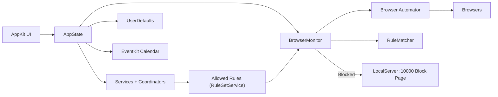

# Free: macOS App Deep Dive

> Reference document for the YouTube video. Covers architecture, logic, threading, features, testing, and design decisions.

---

## Table of Contents

- [Free: macOS App Deep Dive](#free-macos-app-deep-dive)
  - [Table of Contents](#table-of-contents)
  - [1. What is Free?](#1-what-is-free)
  - [2. High-Level Architecture](#2-high-level-architecture)
    - [2-1 Full Architecture Flowchart](#2-1-full-architecture-flowchart)
    - [2-2 Simplified Architecture Flowchart](#2-2-simplified-architecture-flowchart)
  - [3. Module Breakdown](#3-module-breakdown)
    - [3-1 App Entry and Runtime](#3-1-app-entry-and-runtime)
    - [3-2 AppState: The Central Hub](#3-2-appstate-the-central-hub)
    - [3-3 Services Layer](#3-3-services-layer)
    - [3-4 Coordinators Layer](#3-4-coordinators-layer)
    - [3-5 Browser Monitor](#3-5-browser-monitor)
    - [3-6 Browser Automator](#3-6-browser-automator)
    - [3-7 Rule Matcher](#3-7-rule-matcher)
    - [3-8 Local Server](#3-8-local-server)
    - [3-9 Calendar Manager](#3-9-calendar-manager)
    - [3-10 UI Architecture](#3-10-ui-architecture)
  - [4. Threading Model](#4-threading-model)
  - [5. The Blocking Loop (Core Logic)](#5-the-blocking-loop-core-logic)
  - [6. Feature Walkthrough](#6-feature-walkthrough)
    - [6-1 Manual Focus Session](#6-1-manual-focus-session)
    - [6-2 Scheduled Focus Blocks](#6-2-scheduled-focus-blocks)
    - [6-3 Pomodoro Timer](#6-3-pomodoro-timer)
    - [6-4 Quick Breaks](#6-4-quick-breaks)
    - [6-5 Strict and Strict Mode](#6-5-strict-and-strict-mode)
    - [6-6 Allowed Websites and Rule Sets](#6-6-allowed-websites-and-rule-sets)
    - [6-7 Calendar Integration](#6-7-calendar-integration)
    - [6-8 Status Menu](#6-8-status-menu)
  - [7. State Management Deep Dive](#7-state-management-deep-dive)
  - [8. Persistence](#8-persistence)
  - [9. Testing Strategy](#9-testing-strategy)
  - [10. Design Patterns Reference](#10-design-patterns-reference)
    - [Event-Driven Trusted State (BrowserMonitor)](#event-driven-trusted-state-browsermonitor)
    - [Debounced Schedule Checking](#debounced-schedule-checking)
    - [Coordinator Pattern (not Apple's)](#coordinator-pattern-not-apples)
    - [Signature-Based Deduplication (UI Observation)](#signature-based-deduplication-ui-observation)
    - [Challenge-Based Unblock](#challenge-based-unblock)
    - [Grace Period Lock](#grace-period-lock)
  - [11. Notable Tradeoffs and Decisions](#11-notable-tradeoffs-and-decisions)

---

## 1. What is Free?

**Free** is a macOS focus app that blocks distracting websites in real time while you work. It intercepts the active browser tab, checks its URL against your allowed list, and redirects blocked pages to a local block page — all without a browser extension.

**Supported browsers:** Chrome, Safari, Firefox, Brave, Edge, Arc, Opera, Vivaldi.

**Core enforcement modes:**

| Mode | How it triggers |
|---|---|
| Manual | User toggles blocking on/off |
| Scheduled | Weekly calendar blocks (recurring or one-off) |
| Pomodoro | Automatic focus/break cycles |
| Calendar import | EventKit events matched by title rules |

All modes share the same underlying blocking engine — they only differ in *how* the session starts and stops.

---

## 2. High-Level Architecture

```
┌─────────────────────────────────────────────────────────────────┐
│                        AppKit UI (108 files)                    │
│  Shell / Sidebar / Sections / Floating editors / Status menu    │
└────────────────────────┬────────────────────────────────────────┘
                         │ observes @Published
┌────────────────────────▼────────────────────────────────────────┐
│                        AppState (ObservableObject)              │
│  Central published state · Domain-split extensions              │
│                                                                  │
│  ┌──────────────┐  ┌──────────────┐  ┌──────────────────────┐  │
│  │ Coordinators │  │  Services    │  │ Persistence Bindings │  │
│  │ (stateful    │  │ (stateless   │  │ (UserDefaults via    │  │
│  │  orchestrate)│  │  business    │  │  Combine sinks)      │  │
│  └──────┬───────┘  │  logic)      │  └──────────────────────┘  │
│         │          └──────────────┘                             │
└─────────┼───────────────────────────────────────────────────────┘
          │ reads state snapshot / sends actions
┌─────────▼───────────────────────────────────────────────────────┐
│                   BrowserMonitor (1.5 s timer)                  │
│   Reads browser URL → evaluates block → redirects to :10000     │
│                                                                  │
│   DefaultBrowserAutomator          RuleMatcher                  │
│   (AppleScript + AX API)           (NSPredicate cache)          │
└─────────────────────────────────────────────────────────────────┘
          │
┌─────────▼───────────────────────────────────────────────────────┐
│              LocalServer (http://localhost:10000)               │
│              Serves block page HTML                             │
└─────────────────────────────────────────────────────────────────┘
```

### 2-1 Full Architecture Flowchart

```mermaid
flowchart TB
  subgraph UI["AppKit UI"]
    Shell["Shell + Sidebar + Status Item"]
    Focus["Focus Section"]
    RulesUI["Allowed Websites Section"]
    SchedulesUI["Schedules Section"]
    PomodoroUI["Pomodoro Section"]
    CalendarUI["Calendar Section"]
    SettingsUI["Settings Section"]
  end

  subgraph State["State Core"]
    AppState["AppState (@Published source of truth)"]
    ReadModel["AppState Read Model"]
    Facade["AppStateLogicFacade"]
    Persist["AppStatePersistenceCoordinator"]
    Bootstrap["AppStateBootstrapService"]
    Store["SettingsStore (UserDefaults)"]
  end

  subgraph Domain["Domain Services / Coordinators"]
    SessionC["Session Coordinator"]
    SchedC["Schedule Coordinator + ScheduleCheck Coordinator"]
    PomodoroC["Pomodoro Coordinator"]
    PauseC["Pause Coordinator"]
    RulesC["RuleSet Coordinator / Rules Mutation"]
    BlockingC["Blocking Coordinator"]
    RuleSetSvc["RuleSetService (build allowedRules)"]
    ScheduleEngine["ScheduleEngine"]
    PomodoroEngine["PomodoroEngine"]
    PauseEngine["PauseEngine"]
    CalendarSvc["CalendarImport/Sync Services"]
  end

  subgraph Enforcement["Blocking Enforcement"]
    Monitor["BrowserMonitor (1.5s polling)"]
    Matcher["RuleMatcher"]
    Automator["DefaultBrowserAutomator"]
    LocalServer["LocalServer :10000 (block page)"]
  end

  subgraph OS["macOS / External"]
    Browsers["Safari/Chrome/Brave/Edge/Arc/..."]
    AppleScript["AppleScript Automation"]
    AX["Accessibility API (AX)"]
    EventKit["Calendar (EventKit)"]
  end

  Shell --> AppState
  Focus --> AppState
  RulesUI --> AppState
  SchedulesUI --> AppState
  PomodoroUI --> AppState
  CalendarUI --> AppState
  SettingsUI --> AppState

  AppState --> ReadModel
  AppState --> Facade
  Facade --> SessionC
  Facade --> SchedC
  Facade --> PomodoroC
  Facade --> PauseC
  Facade --> RulesC
  Facade --> BlockingC

  SchedC --> ScheduleEngine
  PomodoroC --> PomodoroEngine
  PauseC --> PauseEngine
  RulesC --> RuleSetSvc
  CalendarSvc --> EventKit
  AppState --> CalendarSvc

  Bootstrap --> Store
  Persist --> Store
  Store --> AppState

  AppState -->|"snapshot: isBlocking/isPaused/allowedRules + toggles"| Monitor
  Monitor --> Automator
  Monitor --> Matcher
  RuleSetSvc -->|"allowedRules"| AppState
  Automator --> AppleScript
  Automator --> AX
  AppleScript --> Browsers
  AX --> Browsers
  Monitor -->|"redirect disallowed URL to http://localhost:10000"| Automator
  Browsers --> LocalServer
```



### 2-2 Simplified Architecture Flowchart



**Key principles:**

- **AppKit-first** — full native macOS UI; no SwiftUI for the main app shell.
- **Protocol-decoupled I/O** — browser control, calendar, timers, and persistence are all behind protocols so they're swappable in tests.
- **Unidirectional data flow** — UI reads `AppState`, sends actions through coordinator methods; state flows back via `@Published`.
- **Swift 6** — strict concurrency, `@MainActor` annotations, `NSLock` where needed.

---

## 3. Module Breakdown

### 3-1 App Entry and Runtime

**Files:** `FreeApp.swift`, `FreeAppRuntime.swift`, `AppDelegate.swift`

`FreeApp` is the SwiftUI `@main` entry point (just the entry token — the actual UI is AppKit). It instantiates `FreeAppRuntime` which:

1. Builds the dependency graph (settings store, browser automator, calendar manager, local server).
2. Creates `AppState` and injects all dependencies.
3. Wires the `BrowserMonitor` to `AppState` via `AppStateRuntimeWiringCoordinator`.
4. Bootstraps persisted state via `AppStateBootstrapService`.
5. Creates the main window and status menu item.

`AppDelegate` handles system-level events: `applicationShouldTerminate` blocks quit during strict sessions, permission prompts, app-relocation to `/Applications`.

**Architecture choice:** Thin `@main` struct + fat `Runtime` class keeps the app entry point clean and makes the dependency composition visible in one place.

---

### 3-2 AppState: The Central Hub

**File:** `Sources/Free/Logic/State/AppState.swift` + 15+ extensions

`AppState` is an `ObservableObject` that owns all `@Published` UI-facing properties. It is the single source of truth.

Domain-split via Swift extensions (one file per domain):

| Extension | Responsibility |
|---|---|
| `AppState+Actions` | User-triggered mutations (start session, stop, pause) |
| `AppState+Pomodoro` | Pomodoro phase transitions and timer |
| `AppState+Schedules` | CRUD for schedule blocks |
| `AppState+Rules` | CRUD for rule sets / allowed websites |
| `AppState+Pause` | Quick-break state |
| `AppState+Calendar` | Calendar sync and import rules |
| `AppState+ReadModel` | Derived/computed state for UI |
| `AppState+Settings` | Appearance, theme, launch-at-login |

**Why split into extensions?** `AppState` would be a 2000+ line god-object otherwise. Extensions let each feature domain own its slice while sharing the `@Published` backing store.

---

### 3-3 Services Layer

Services are **stateless** — they receive state as input, return new state as output. Zero side effects.

| Service | What it does |
|---|---|
| `BlockingSessionService` | Computes next session state (blocking on/off transitions) |
| `ScheduleEngine` | Given a date/time, returns which schedules are currently active |
| `PomodoroEngine` | Pomodoro state machine: focus → break → focus |
| `PauseEngine` | Counts down break time, determines if still paused |
| `RuleSetService` | Resolves the active rule set for the current session |
| `CalendarImportService` | Maps EventKit events to focus/break schedule entries |
| `LaunchAtLoginService` | Registers/deregisters app with SMLoginItemSetEnabled |

**Architecture choice — stateless services:** Each service can be unit-tested with zero setup. Pass in state, assert on output. No mocking, no dependencies.

---

### 3-4 Coordinators Layer

Coordinators are **stateful orchestrators** — they hold references to services, other coordinators, and `AppState`. They receive action calls, compute new state via services, and apply mutations.

Key coordinators:

**`AppStateSessionCoordinator`**
Handles `startSession()`, `stopSession()`. Checks strict-mode constraints, delegates to `BlockingSessionService`, publishes new session state.

**`AppStateScheduleCheckCoordinator`**
Called by `BrowserMonitor` and timer ticks. Runs `ScheduleEngine` against current date/time. If a schedule becomes active, starts a session automatically. Debounced via `PassthroughSubject` (100 ms) to avoid thrashing on rapid state changes.

**`AppStatePomodoroCoordinator`**
Manages pomodoro phase: start, skip, stop. Enforces 10-second grace-period lock in strict mode. Delegates timer ticks to `PomodoroEngine`.

**`AppStatePauseCoordinator`**
Manages quick breaks. Starts countdown, processes timer ticks, ends break and resumes blocking.

**`AppStateTimerCoordinator`**
Owns the `RepeatingTimerScheduler` instances. Replaces timers cleanly when settings change (e.g. pomodoro duration edit). Protected by `NSLock` for timer replacement.

**`AppStatePersistenceCoordinator`**
Creates Combine sink chains: `$property.dropFirst().sink { settingsStore.set(value) }` for every persisted property. `dropFirst()` skips the initial value load to avoid a write-on-read loop.

**`AppStateRuntimeWiringCoordinator`**
Bridges `BrowserMonitor` callbacks into `AppState` actions. Keeps the monitor protocol-agnostic (it calls `onBlockedURL(url:browser:)` — the coordinator decides what happens).

---

### 3-5 Browser Monitor

**File:** `Sources/Free/Logic/BrowserMonitor.swift`

The beating heart of the app. Runs on a **1.5-second repeating timer**.

Each tick:

1. Read a **state snapshot** (is blocking active? which rule set?) — lock-free read of value types.
2. Ask `BrowserAutomator` for the frontmost browser's current URL.
3. Pass URL + rule set to `RuleMatcher`.
4. If blocked: call `BrowserAutomator.redirect(to: "http://localhost:10000")`.
5. Enforce redirect cooldown per-browser via `redirectLock` + `lastRedirectTime` dictionary (2-second debounce — avoids redirect loop if user navigates back quickly).

**Event-driven for trusted state:** Rather than re-evaluating `isBlocking` every tick from scratch, the monitor now receives a `TrustedState` snapshot pushed by `AppState` whenever blocking state changes. This means: no redundant state recomputation inside the monitor, and the monitor can't disagree with AppState.

**Architecture choice — polling vs. accessibility notifications:** macOS accessibility does not provide reliable "tab URL changed" notifications across all browsers. A 1.5s poll is the pragmatic choice — low enough CPU cost, fast enough response time.

---

### 3-6 Browser Automator

**Files:** `DefaultBrowserAutomator.swift`, `DefaultBrowserAutomatorSystemBridge.swift`

Protocol: `BrowserAutomator`

```swift
protocol BrowserAutomator {
    func currentURL(for browser: Browser) async -> URL?
    func redirect(browser: Browser, to url: URL) async
}
```

Implementation uses two mechanisms:

| Mechanism | Used for | Why |
|---|---|---|
| AppleScript | Chrome, Firefox, Safari, Brave, Edge, Opera, Vivaldi | Fast, reliable URL get/set |
| Accessibility API (AX) | Arc | Arc doesn't expose URL via AppleScript; AX reads address bar text |

`DefaultBrowserAutomatorSystemBridge` isolates system calls (`AXUIElement`, `NSWorkspace`, `NSRunningApplication`) so the automator itself can be tested with a mock bridge.

**Why no browser extension?** No installation friction for the user. The trade-off is relying on AppleScript/AX permissions — the app prompts for these on first launch.

---

### 3-7 Rule Matcher

**File:** `Sources/Free/Logic/RuleMatcher.swift`

Evaluates whether a URL is in the allowed list.

Pattern syntax:

- `example.com` — exact domain match
- `*.example.com` — any subdomain
- `example.com/docs/*` — path prefix
- `*` — match everything (allow all)

**Implementation:**

- Patterns converted to `NSPredicate` with `LIKE` operator (wildcard-aware).
- Predicates cached in a dictionary keyed by pattern string — avoids recompilation on every tick.
- Domain normalization strips `www.`, lowercases, removes trailing slash.

**Architecture choice — NSPredicate vs regex:** `NSPredicate LIKE` handles `*` and `?` wildcards natively, is fast, and is familiar to users. Full regex would be more powerful but harder to explain to non-technical users.

---

### 3-8 Local Server

**File:** `Sources/Free/Logic/LocalServer.swift`

Protocol: `LocalServerConnection`

Runs a minimal HTTP server on `http://localhost:10000`. When the browser is redirected there, it displays the block page HTML.

Runs on `DispatchQueue.global()`. Incoming connections are handled asynchronously; the response is a static HTML string baked into the binary.

**Why localhost vs a custom URL scheme?** Custom URL schemes require the browser to have the app registered as a handler, which varies by browser. A plain HTTP server on localhost works universally.

---

### 3-9 Calendar Manager

**Files:** `CalendarManager.swift`, `CalendarManagerRuntime.swift`

Protocol: `CalendarProvider`

Uses EventKit to read calendar events. Refreshes every 5 minutes via a repeating timer.

`CalendarImportService` processes fetched events:

1. Apply user-defined import rules (regex match on event title).
2. Classify each matched event as `focus` or `break`.
3. Create virtual `Schedule` entries from events.
4. Merge with user-defined schedules for blocking evaluation.
5. Track suppressed events (user dismissed from calendar import).

**Mock calendar:** `MockCalendarManager` is used in tests — no EventKit dependency, injects fake events directly.

---

### 3-10 UI Architecture

**108 AppKit files** in `Sources/Free/UI/`.

**Shell:**

- `FreeMainViewController` — root, hosts sidebar + content area.
- `MainSidebarView` — `NSStackView`-based sidebar with section buttons.
- `MainSheetPresenter` — manages modal sheet lifecycle.

**Sections** (all `NSViewController`):

1. **Focus** — main dashboard: status card, pause dashboard, quick break, live overview.
2. **Schedules** — weekly calendar with drag/drop schedule blocks.
3. **Rules** — allowed websites table, add/edit/delete, import from clipboard.
4. **Calendar** — sync settings, import rules editor.
5. **Pomodoro** — timer display, phase controls.
6. **Settings** — appearance, theme, launch-at-login.

**State observation pattern (`AppKitAppStateObservation`):**

```
Publishers.MergeMany([publisher1, publisher2, ...])
    .debounce(for: .milliseconds(16), scheduler: RunLoop.main)
    .sink { [weak self] _ in self?.render() }
```

Each view controller declares which `@Published` properties it cares about, subscribes to them merged, and calls a `render()` method that reads current `AppState` and updates the view. This is the AppKit equivalent of a SwiftUI `body` — explicit but controlled.

**Why AppKit over SwiftUI?**

- The app targets macOS 14+, but was started before SwiftUI was production-ready for complex layouts.
- AppKit gives precise control over `NSTableView`, drag-and-drop in the calendar, animation timing, and window chrome.
- SwiftUI views are embedded in specific places (e.g. the weekly calendar blocks use SwiftUI for the block content inside an AppKit container).

---

## 4. Threading Model

```
Main Thread (DispatchQueue.main / @MainActor)
├── All @Published mutations
├── AppKit UI updates
├── Accessibility API calls (AXUIElement reads)
├── AppleScript execution
└── Timer coordinator callbacks

Background Thread (DispatchQueue.global)
├── BrowserMonitor tick (1.5s timer fires here)
│   └── reads state snapshot (value types, safe)
│   └── calls BrowserAutomator (async, awaited)
│   └── dispatches state mutations back to main
├── LocalServer HTTP listener
└── EventKit calendar fetch
```

**Thread-safety mechanisms:**

| Mechanism | Where used | Why |
|---|---|---|
| `NSLock` | `BrowserMonitor.redirectLock` | Guards `lastRedirectTime` dict modified on background, read on background |
| `NSLock` | `AppStateTimerCoordinator.timerLock` | Prevents race when replacing a running timer |
| `@MainActor` | `FreeShellState` | All UI shell mutations on main thread |
| `DispatchQueue.main.async` | Calendar fetch completion | EventKit callbacks arrive on background |
| Value-type snapshots | `BrowserMonitor` state reads | Copies of structs are immutable; no lock needed |

**Why not Swift actors everywhere?** The codebase targets Swift 6 strict concurrency. `@MainActor` is used on the UI layer. The monitor uses `NSLock` for its small critical sections rather than an actor because the lock scope is tiny and the overhead of actor hops would add latency to the 1.5s loop.

---

## 5. The Blocking Loop (Core Logic)

This is the most important flow to understand:

```
Every 1.5 seconds:
┌─ BrowserMonitor.tick() ──────────────────────────────────────────┐
│                                                                   │
│  1. snapshot = trustedState  // value type, thread-safe copy     │
│                                                                   │
│  2. if !snapshot.isBlocking → return early (fast path)           │
│                                                                   │
│  3. url = await automator.currentURL(for: frontmostBrowser)      │
│     └─ AppleScript or AX API depending on browser                │
│                                                                   │
│  4. allowed = ruleMatcher.isAllowed(url, ruleSet: snapshot.rules) │
│     └─ NSPredicate cache lookup                                  │
│                                                                   │
│  5. if allowed → return                                           │
│                                                                   │
│  6. cooldown check: lastRedirectTime[browser] < now - 2s?         │
│     └─ NSLock read                                               │
│                                                                   │
│  7. automator.redirect(browser, to: "http://localhost:10000")    │
│     └─ AppleScript set URL                                       │
│                                                                   │
│  8. lastRedirectTime[browser] = now  // NSLock write             │
└───────────────────────────────────────────────────────────────────┘
```

**What makes blocking start?**

```
User action / Schedule tick / Calendar event
         ↓
AppStateSessionCoordinator.startSession()
         ↓
AppState.isBlocking = true  (@Published, main thread)
         ↓
AppStateRuntimeWiringCoordinator observes change
         ↓
BrowserMonitor.trustedState updated (value type push)
         ↓
Next tick: fast path no longer skips → blocking active
```

**What makes blocking stop?**
Same chain in reverse: `stopSession()` → `isBlocking = false` → monitor snapshot updated → fast path resumes.

---

## 6. Feature Walkthrough

### 6-1 Manual Focus Session

**How to use:**

1. Open the app → Focus section.
2. Select an allowed website list from the dropdown.
3. Toggle the "Start Focusing" button.
4. Any browser tab not in your allowed list redirects to the block page.
5. Toggle off to stop.

**Logic:** `AppState+Actions.startManualSession()` → `AppStateSessionCoordinator` → sets `isBlocking = true`, `wasStartedBySchedule = false`. Stopping clears the session.

---

### 6-2 Scheduled Focus Blocks

**How to use:**

1. Go to Schedules section.
2. Drag on the weekly calendar to create a block.
3. Assign a time range, days of the week, and an allowed list.
4. Optionally set it as a one-off (single date) instead of recurring.
5. The block activates automatically at the scheduled time.

**Logic:**

- `ScheduleEngine.activeSchedules(at: Date)` checks all enabled schedules.
- `AppStateScheduleCheckCoordinator` runs on every timer tick and on state changes (debounced 100ms).
- If a schedule becomes active and no manual session is running → auto-start session.
- If the active schedule ends → auto-stop (unless manual blocking was on before).
- Schedule blocks can be paused manually: `manuallyPausedScheduleIds` set tracks which are suppressed this session.

**One-off vs. recurring:**

```swift
struct Schedule {
    var days: Set<Int>       // 0=Sun … 6=Sat  (recurring)
    var date: Date?          // set for one-off
    var startTime: DateComponents
    var endTime: DateComponents
}
```

---

### 6-3 Pomodoro Timer

**How to use:**

1. Go to Pomodoro section, configure focus/break durations (default 25m/5m).
2. Click Start. Blocking activates for the focus phase.
3. When focus ends, break phase begins (blocking pauses).
4. Cycles automatically.

**Logic (`PomodoroEngine`):**

```
none → focus (blocking on, timer starts)
     → breakTime (blocking off, break timer starts)
     → focus (auto-restart)
     → none (user stops)
```

**Strict mode lockout:** After 10 seconds into a focus phase, stopping or skipping requires a challenge phrase (strict mode only).

**State:**

```swift
struct PomodoroState {
    var status: PomodoroStatus  // .none | .focus | .breakTime
    var remaining: TimeInterval
    var startedAt: Date?
    var ruleSetId: UUID?
}
```

---

### 6-4 Quick Breaks

**How to use:**

1. During any active session, click "Take a Break" in the Focus section.
2. Choose a preset (5m, 15m, 30m) or enter custom minutes.
3. Blocking pauses for the break duration, then resumes automatically.

**Logic (`PauseEngine`):**

- Creates a countdown timer.
- `isBlocking` stays true at the `AppState` level — but `PauseEngine.isPaused` overrides the block evaluation.
- `AppStateBlockingCoordinator.shouldBlock()` checks: `isBlocking && !isPaused`.
- When pause expires → blocking resumes without user action.

---

### 6-5 Strict and Strict Mode

**How to use:**

1. Settings → enable "Strict Mode" (called "Strict" internally).
2. Once enabled with an active session, you cannot stop without typing the challenge phrase.

**Challenge phrase:**
> "I am choosing to break my focus and I acknowledge that this may impact my productivity."

**Logic:**

- `AppStateChallengeCoordinator.verifyChallenge(input:)` does an exact string match.
- On success: temporarily sets `isStrict = false` for the stop operation, then restores it.
- App quit is blocked (`applicationShouldTerminate` returns `.terminateLater`) during strict active sessions.
- Status menu "Quit" item is hidden.
- Certain settings (e.g. disabling strict mode) are locked during an active strict session.

---

### 6-6 Allowed Websites and Rule Sets

**How to use:**

1. Go to Rules section.
2. Create a rule set (e.g. "Work", "Study").
3. Add URL patterns: `news.ycombinator.com`, `*.github.com`, `docs.swift.org/*`.
4. Built-in presets available: "Allow search engines", "Allow AI assistants".
5. Assign the rule set to a session or schedule.

**Pattern matching:**

| Pattern | Matches |
|---|---|
| `github.com` | `github.com` only |
| `*.github.com` | `gist.github.com`, `api.github.com`, etc. |
| `github.com/*` | Any path on `github.com` |
| `*` | Everything (effectively disables blocking) |

**Implementation:** `RuleMatcher` normalizes the input URL, converts each pattern to an `NSPredicate(format: "self LIKE[c] %@", pattern)`, caches the predicate, and evaluates.

---

### 6-7 Calendar Integration

**How to use:**

1. Go to Calendar section.
2. Grant EventKit access.
3. Create import rules: e.g. "if event title contains 'Focus' → start focus session".
4. Calendar events matching the rule auto-create schedule blocks.
5. Events can be individually suppressed from the UI.

**Logic (`CalendarImportService`):**

1. Fetch events for the current week from EventKit.
2. For each event, test title against import rules (regex or contains).
3. Matched events become virtual `Schedule` entries (type: focus or break).
4. These merge with user schedules in `ScheduleEngine.activeSchedules()`.
5. Refresh every 5 minutes.

**Suppression:** If a user suppresses a calendar event, its `UUID` is stored in `suppressedEventIds` (persisted). Suppressed events are skipped during import.

---

### 6-8 Status Menu

The app lives in the macOS menu bar. The status menu shows:

- Current mode (Blocking / Paused / Idle).
- Active rule set name.
- Pomodoro phase and remaining time.
- Quick actions: Start/Stop, Take a Break, Quit.

The icon changes color: green dot when actively blocking, default when idle.

During strict mode with active blocking: Quit is hidden from the menu.

---

## 7. State Management Deep Dive

`AppState` owns roughly 40 `@Published` properties. Here is a simplified view:

```swift
class AppState: ObservableObject {
    // Session
    @Published var isBlocking: Bool
    @Published var wasStartedBySchedule: Bool
    @Published var manuallyPausedScheduleIds: Set<UUID>

    // Pomodoro
    @Published var pomodoroStatus: PomodoroStatus
    @Published var pomodoroRemaining: TimeInterval

    // Pause
    @Published var isPaused: Bool
    @Published var pauseRemaining: TimeInterval

    // Rules
    @Published var ruleSets: [RuleSet]
    @Published var activeRuleSetId: UUID?

    // Schedules
    @Published var schedules: [Schedule]

    // Settings
    @Published var isStrict: Bool
    @Published var appearanceMode: AppearanceMode
    @Published var accentColor: FocusColor
    // ... ~25 more
}
```

**Read Model:** `AppStateReadModelCoordinator` computes derived state for the UI:

- `currentPrimaryRuleSetId` — which rule set is active right now (session > schedule > pomodoro priority).
- `currentPrimaryRuleSetName` — display name for status menu.
- `allowedRules` — the actual URL patterns for the active rule set.

This prevents UI components from having to re-derive state independently and avoids inconsistencies.

---

## 8. Persistence

All settings are stored in `UserDefaults` via `SettingsStore`.

`AppStatePersistenceCoordinator` creates Combine bindings at startup:

```swift
appState.$isBlocking
    .dropFirst()  // skip initial load value
    .sink { [weak self] value in
        self?.settingsStore.set(value, forKey: .isBlocking)
    }
    .store(in: &cancellables)
```

And the reverse — `AppStateBootstrapService` reads all stored values at launch and populates `AppState`.

**Persisted data includes:** session state, all schedules, all rule sets, pomodoro config, calendar import rules, appearance settings, strict mode, launch-at-login preference.

**Data integrity:** `DataIntegrityTests.swift` verifies that encode → decode roundtrips for all models produce identical values.

---

## 9. Testing Strategy

Tests live in `Tests/FreeTests/` — 20+ test files.

**Test framework:** Swift Testing (new `#expect`, `@Test` macros from Xcode 16+).

**Coverage:** Run with `make coverage` which sets `FREE_COVERAGE_MODE=1` env var. Some code paths (permission prompts, app relocation) are gated behind this flag to avoid breaking tests.

**Test doubles:**

| Dependency | Test double |
|---|---|
| `CalendarProvider` | `MockCalendarManager` — inject fake events |
| `BrowserAutomator` | Mock automator — return preset URLs |
| `SettingsStore` | In-memory store (no UserDefaults pollution) |
| `RepeatingTimerScheduling` | Mock timer — fire manually in tests |
| `LocalServerConnection` | No-op mock |

**What is tested:**

| Test file | Coverage |
|---|---|
| `AppStateSessionCoordinatorTests` | Start/stop blocking, strict mode constraints |
| `AppStatePomodoroCoordinatorTests` | Phase transitions, grace period locking |
| `AppStateScheduleMutationCoordinatorTests` | Schedule CRUD, overlap detection |
| `CalendarManagerTests` | EventKit fetch, import rule matching |
| `AllowedWebsitesCoordinatorsTests` | Rule set CRUD, pattern validation |
| `DataIntegrityTests` | Model encode/decode roundtrips |
| `PersistenceTests` | Settings store read/write |
| `RulesViewTests` | UI rendering of rule sets |
| `SchedulesViewTests` | UI rendering of schedule blocks |
| `PomodoroWidgetTests` | Timer display |
| `AppDelegateTests` | App startup sequence |

**Testing philosophy:**

- Services are unit-tested in isolation (pure input → output).
- Coordinators are tested with mock dependencies.
- UI tests use ViewInspector to assert on AppKit view state.
- Integration tests (calendar, persistence) use real subsystems with cleanup.

---

## 10. Design Patterns Reference

### Event-Driven Trusted State (BrowserMonitor)

Rather than the monitor calling back into `AppState` to ask "should I block?", `AppState` pushes a `TrustedState` value type snapshot to the monitor whenever blocking state changes. The monitor only reads this snapshot — no lock contention, no callback chain.

### Debounced Schedule Checking

```swift
scheduleCheckSubject
    .debounce(for: .milliseconds(100), scheduler: RunLoop.main)
    .sink { [weak self] _ in self?.evaluateSchedules() }
```

Schedule evaluation is expensive (iterate all schedules). Rapid changes (e.g. user editing times) collapse into a single evaluation.

### Coordinator Pattern (not Apple's)

Each coordinator owns one domain of mutations. It holds a weak reference to `AppState` and strong references to the services it needs. Coordinators never call each other directly — they go through `AppState` actions.

### Signature-Based Deduplication (UI Observation)

View controllers compute a "signature" hash of the state fields they care about. If the signature hasn't changed since last render, `render()` is a no-op. Prevents redundant UI work when unrelated `@Published` properties change.

### Challenge-Based Unblock

Strict mode requires the user to demonstrate intent by typing a full sentence. This is not security — it's a speed bump for impulse decisions.

### Grace Period Lock

10 seconds after starting a pomodoro focus phase in strict mode, the skip/stop actions become unavailable. Prevents immediately breaking the session right after starting.

---

## 11. Notable Tradeoffs and Decisions

| Decision | Tradeoff |
|---|---|
| AppKit over SwiftUI | More code, full control. SwiftUI drag-and-drop on macOS was unreliable when started. |
| Polling (1.5s) over AX notifications | Simpler, reliable across all browsers. Max 1.5s delay before redirect. |
| AppleScript + AX hybrid | AppleScript doesn't work on Arc; AX does. Both needed for full browser coverage. |
| localhost:10000 block page | No browser extension required. Port 10000 could theoretically conflict with other apps. |
| NSPredicate for URL matching | Simple wildcard syntax for users. Can't express complex regex patterns. |
| UserDefaults for persistence | Simple, no migrations needed. Not suitable if data were large. |
| Value-type state snapshots | Thread-safe reads without locks. Requires discipline to not pass mutable refs. |
| 30+ coordinators | High file count, but each is small and focused. Avoids monolithic AppState mutations. |
| Swift 6 strict concurrency | Catches data races at compile time. Required adapting legacy NSLock patterns. |

---

*Generated: 2026-03-23 | Free macOS App*
